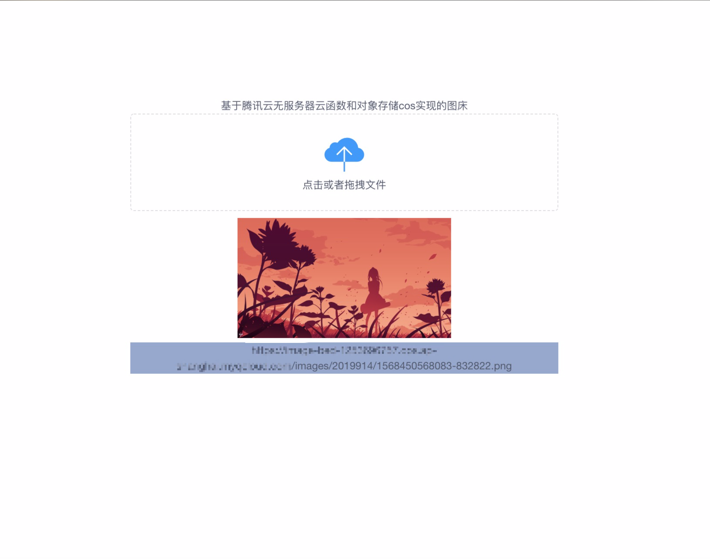
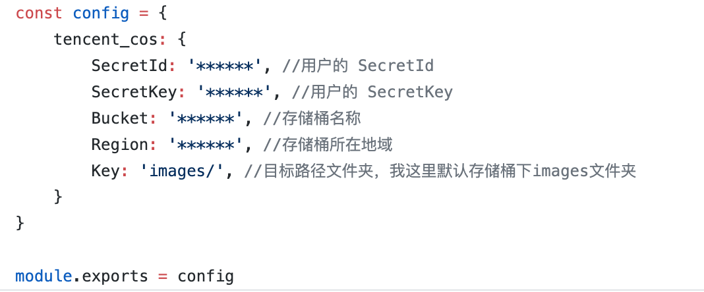
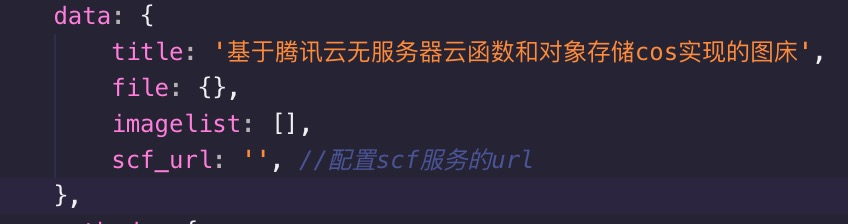
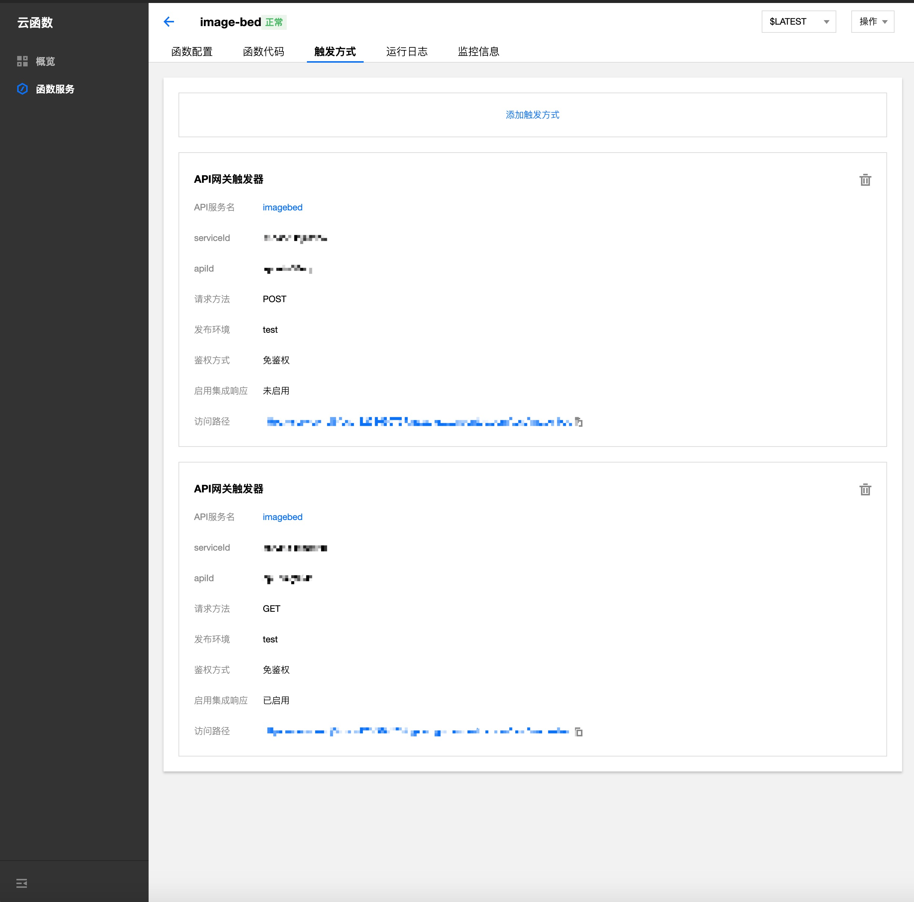

# scf_imgbed
基于腾讯云无服务器云函数和对象存储cos实现的图床。

首先介绍下[腾讯云无服务器云函数](https://cloud.tencent.com/product/scf)和[腾讯云对象存储](https://cloud.tencent.com/product/cos)

## 主界面

## 如何使用

本项目使用了[腾讯云无服务器云函数](https://cloud.tencent.com/product/scf)和[腾讯云对象存储](https://cloud.tencent.com/product/cos),所以如要使用请开通这两个服务。

clone本仓库或者下载zip包直接上传[腾讯云无服务器云函数](https://cloud.tencent.com/product/scf)也可（这里强烈推荐下腾讯云云函数产品的命令行工具[SCF CLI](https://cloud.tencent.com/document/product/583/33445)）

请打开[defaultconfig](defaultconfig.js)文件,你可以看见
这些配置项,上面两项SecretId和SecretKey可以在[这里](https://console.cloud.tencent.com/cam/capi)获取,Bucket和Region需要在[对象存储](https://cloud.tencent.com/product/cos)新建一个存储桶获得

以上完成后请更改defaultconfig.js为config.js

当你把项目成功上传到scf后,需要进入函数服务点击函数名&rArr;触发方式&rArr;添加触发方式
1. 触发方式选择API网关触发器
2. 请求方法添加一个GET(展示上传页面,若不需要可不添加)和一个POST(上传图片接口)。注：GET需要开启集成响应，post接口需要开启cors(点击api服务名即可配置)
3. 如若使用upload.html实现上传,请获取上一步获取的POST地址后，需要填写在[upload.html](upload.html)中的scf_url后面
4. enjoy

## 其他
暂无，有问题可以提出问题反馈

